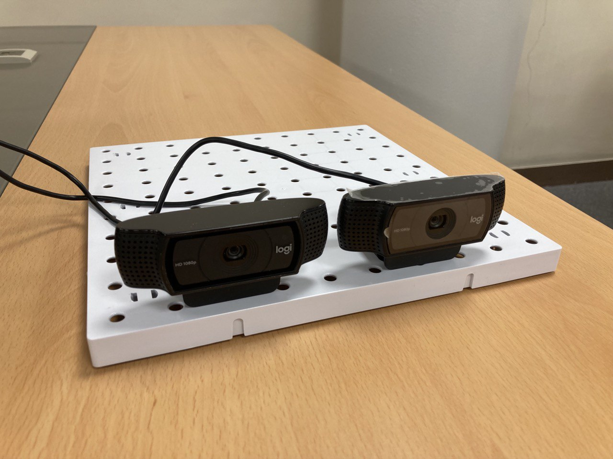

# stereo camera를 활용한 거리 추정
2차원 영상에서는 동일한 물체의 길이나 면적을 구하여도 카메라로 부터의 거리에 따라서 길이나 면적이 달라진다.<br/>
stereo camera를 활용하여 거리 정보를 구하면 거리의 변화에도 동일한 물체에 대해서 동일한 길이와 면적을 구할 수 있다.<br/><br/>

## 환경
* setup_environment.sh<br/><br/>

## 빌드
    ```bash
    mkdir build && cd build
    cmake ..
    make
    ```

## 실행 순서
1. 스테레오 캘리브레이션을 위한 이미지 캡쳐
    ```bash
    $ ./capture_images ../settings/default.yml
    ```
    
2. 스테레오 캘리브레이션
    ```bash
    $ ./calibrate ../settings/default.yml
    ```

3. Z축 캘리브레이션을 위한 단위 거리별 이미지 캡쳐
    ```bash
    $ ./estimateZ ../settings/default.yml -mode=2
    ```
    왼쪽 카메라 화면 중심에 하얀색 사각형이 표시되는데, chess board를 이 사각형에 위치하도록 조정하여 거리를 이동하면 1cm 단위로 Z 캘리브레이션 용 이미지가 저장된다.
    
4. Z축 캘리브레이션
    ```bash
    $ ./calibrateZ ../settings/default.yml
    ```
5. 거리 추정, 거리에 따른 원의 지름과 면적 측정
    ```bash
    $ ./estimateZ ../settings/default.yml -mode=1
    ```
    거리 추정, 거리에 따른 원의 지름과 면적 측정<br/><br/>

## 기타
* common.hpp<br/>
    공통으로 사용하는 함수<br/>
* record_stereo_cideo.cpp<br/>
    스테레오 영상 저장용<br/><br/>

## 데모 영상
https://youtu.be/H-9846qvp3w<br/><br/>

## 만든 스테레오 카메라
